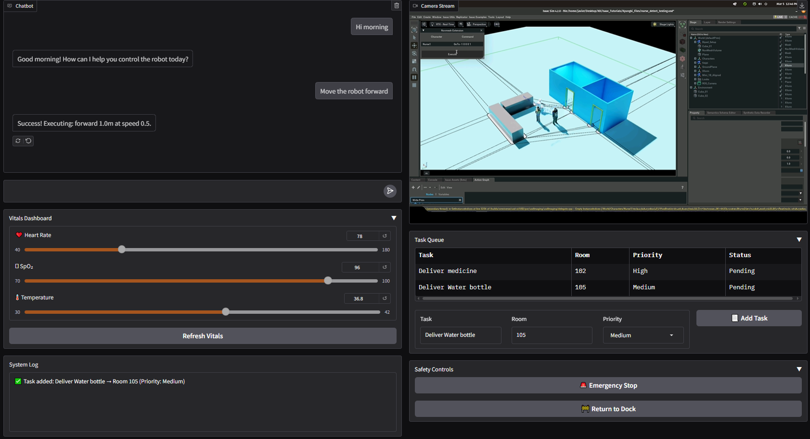

# LLM_GUI
This repository represents a GUI to monitor and control a robot and patient details.

## GUI

<!--  -->
## Pre-requisites
- Make a .env file and add your OPEN_AI_KEY. Use below line to add in the .end file

    `OPENROUTER_API_KEY='<YOUR-KEY>'`

- Then run the `web_gui.py` script to get the server running and access to the web based GUI

